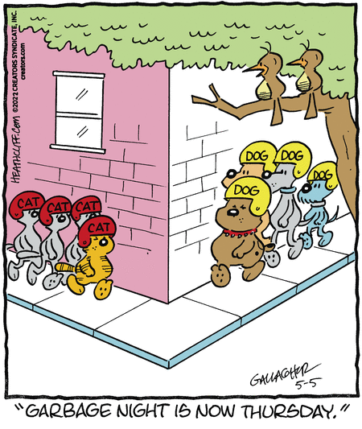

# Heathcliff Prime

This repository houses a set of Python scripts that scrapes [gocomics](https://www.gocomics.com) for Heathcliff comics, takes them apart, and randomly rearranges their captions. These arguably better comics are called **Heathcliff Primes** Check out the [examples](./primes/funny-examples/) for good results. 